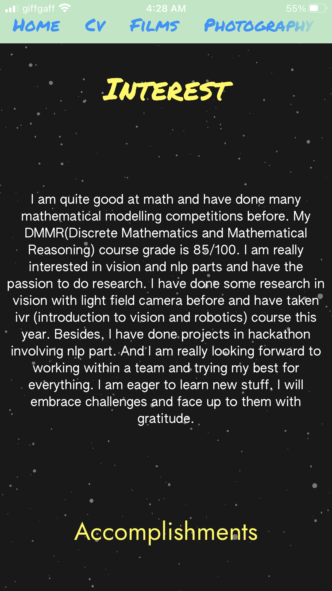

# Jerry-s-personal-introduction-ios-app
personal introduction iOS app: which covert my personal webpage to an iOS app. It support forward and backward paging gesture.

Changing the files in ViewController and adding webview.xxx property.

  
   
  

  
   
  

  
   
  
  

